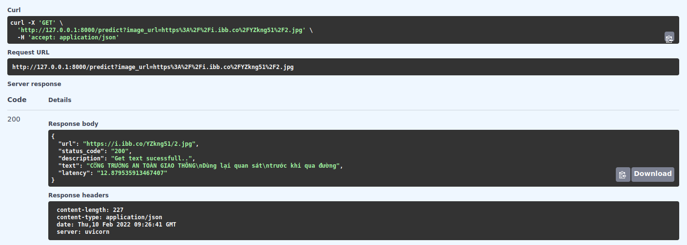

### Quickstart
```bash
pip install torch==1.7.0+cu101 torchvision==0.8.1+cu101 -f https://download.pytorch.org/whl/torch_stable.html
pip install --upgrade ultocr  # install our project with package

# for inference phase
from ultocr.inference import OCR
from PIL import Image
model = OCR(det_model='DB', reg_model='MASTER')
image = Image.open('..')  # ..is the path of image
result = model.get_result(image)
```
Or view in google colab [demo](https://colab.research.google.com/drive/1rncaTU_S8mjVusaOq3u9L_FT8ADSECeC?usp=sharing)

### Install
```bash
git clone https://github.com/cuongngm/text-in-image
pip install torch==1.7.0+cu101 torchvision==0.8.1+cu101 -f https://download.pytorch.org/whl/torch_stable.html
pip install -r requirements.txt
bash scripts/download_weights.sh
```
### Prepare data


### Pretrained model
| Model                                                                                        | size(MB) |
|----------------------------------------------------------------------------------------------|------ |
| [DB](https://drive.google.com/file/d/1IhNXc1aaiuNtcC-LniwgfYylc6Du5LIX/view?usp=sharing)     |140    
| [MASTER](https://drive.google.com/file/d/1xQccsZiNVWoB1g59fi11RHn1CkpjRlVN/view?usp=sharing) |261     


### Train
Custom params in each config file of config folder then:

Single gpu training:
```bash
python train.py --config config/db_resnet50.yaml --use_dist False
# tracking with mlflow
mlflow run text-in-image -P config=config/db_resnet50.yaml -P use_dist=False -P device=1
```
Multi gpu training:
```bash
# assume we have 2 gpu
python -m torch.distributed.launch --nnodes=1 --node_rank=0 --nproc_per_node=2 --master_addr=127.0.0.1 --master_post=5555 train.py --config config/db_resnet50.yaml
```

### Serve and Inference
```bash
python run.py
```
Then, open your browser at http://127.0.0.1:8000/docs. Request url of the image, the result is as follows:
<!--


-->

<div align=center>

</div>

### Todo
- [x] Multi gpu training
- [x] Tracking experiments with Mlflow
- [x] Model serving with FastAPI
- [ ] Add more text detection and recognition model

### Reference
- [DB_text_minimal](https://github.com/huyhoang17/DB_text_minimal)
- [pytorchOCR](https://github.com/BADBADBADBOY/pytorchOCR)
- [MASTER-pytorch](https://github.com/wenwenyu/MASTER-pytorch)
- [DBNet.pytorch](https://github.com/WenmuZhou/DBNet.pytorch)
